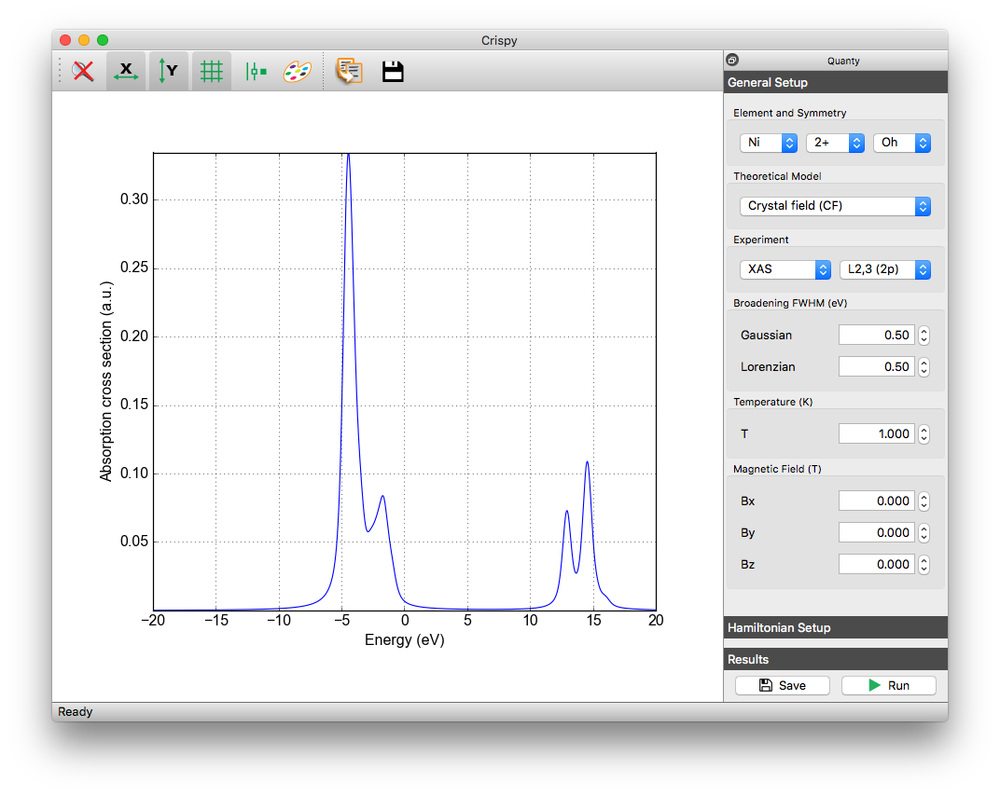

crispy
======

Crispy is a graphical user interface written in `Python <https://www.python.org/>`_ that facilitates the simulation of core-level spectra. The interface provides a set of tools to generate input files, submit calculations, and analyze the results obtained with programs such as `Quanty <http://quanty.org>`_ and `ORCA <https://orcaforum.cec.mpg.de>`_ (planned). It has a modular design and can be run on Mac OS X, Linux, Windows platforms.

Dependencies
------------
Crispy depends on the following Python packages:

* `PyQt5 <https://riverbankcomputing.com/software/pyqt/intro>`_
* `matplotlib <http://matplotlib.org>`_
* `numpy <http://www.numpy.org>`_
* `silx <https://github.com/silx-kit/silx>`_

Instalation
-----------
The easiest way to install crispy is to use the installers provided on the `releases <https://github.com/mretegan/crispy/releases>`_ page; currently these are only available for Windows. While being simple to use, the installers are not updated very frequently, and might lack newly implemented features. 

If you want to use the latest development version, you have to build crispy from source. For this a working Python 3.5 (or newer) installation is required. On Linux, Python can be installed using the system's package manager (``apt-get``, ``dnf``, ``pacman``, etc.). On Mac OS X and Windows, you can install Python using the `official <https://www.python.org/downloads>`_ installers.

After the installation, the remaining dependencies can be installed using ``pip``::

    pip install PyQt5 numpy silx

**Note**: It is possible that the development version of crispy requires features that are not yet available with the pip installable version of silx. In this case you have to also install silx from source. This is not always a very simple task, especially on Windows, but there is extensive `documentation <https://pythonhosted.org/silx>`_ on how to do it. 

The source code for crispy can be downloaded from GitHub either as an `archive <https://github.com/mretegan/crispy/archive/master.zip>`_ or using ``git``::

    git clone https://github.com/mretegan/crispy.git

To install it, run::

    cd crispy
    pip install . [--user]

**Note**: External programs required to run the spectroscopy calculations have to be installed and the PATH environment variable must be set for crispy to be able to use them.

Usage
-----
If you have used the installers, crispy should be easy to find and launch. For the installation from source you can start crispy from the command line using::

    crispy

This is a binary file created during the installation and should be available if the PATH environment variable was set correctly during the initial Python installation. Alternatively you run crispy using::

    python path_to_crispy/scripts/crispy

You can also started crispy without installing it by going to the source directory and executing::

    python -m crispy

License
-------

The source code of crispy is licensed under the MIT license.
