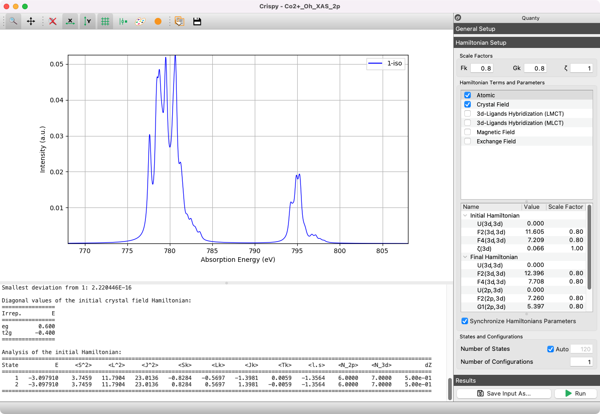

Welcome to the Crispy documentation!
====================================

.. include:: ../README.rst
    :end-before: first-marker

Crispy is written using `Python <https://www.python.org/>`_ and relies on
several additional open-source scientific libraries that are part of the Python
ecosystem. The application runs on all major operating systems, and is free and
open-source software. The current development can be followed on the `GitHub
<https://github.com/mretegan/crispy>`_ page.

The project is developed at the `European Synchrotron Radiation Facility
<http://esrf.eu>`_ by `Marius Retegan <http://marius.retegan.org>`_.

    The main window of Crispy showing a calculated XAS spectrum for |Co2+|.

.. |Co2+| replace:: Co\ :sup:`2+`\

Contents
--------
.. toctree::
    :maxdepth: 2

    getting_started/index
    user_guide/index
    tutorials/index
    about/index
