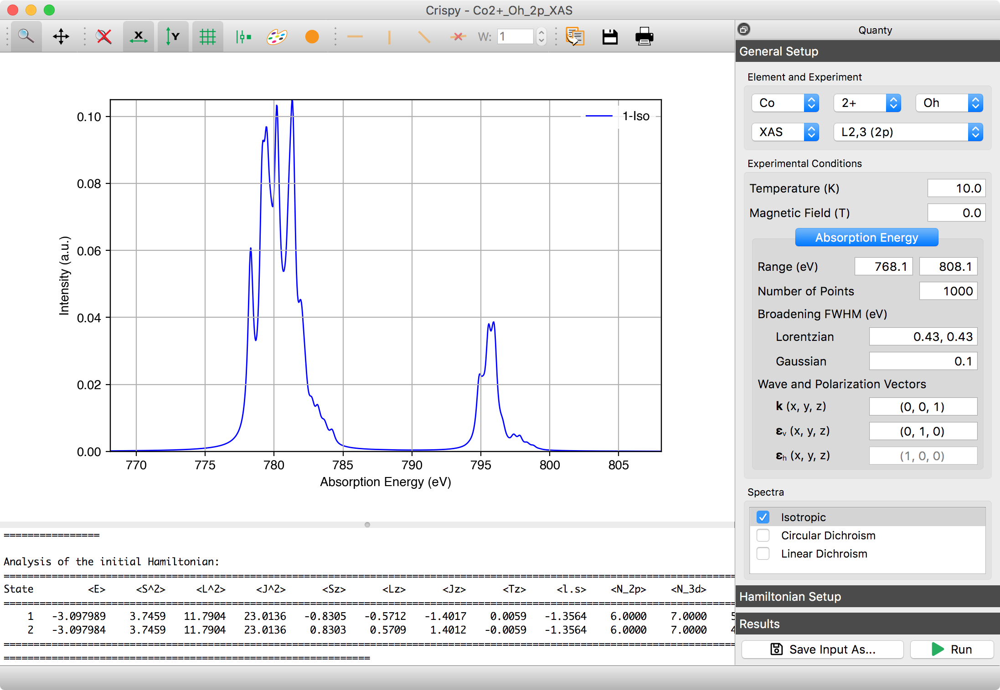

Welcome to the Crispy documentation!
====================================

.. include:: ../README.rst
    :end-before: first_marker

Crispy is written using `Python <https://www.python.org/>`_ and relies on a number of additional open-source scientific libraries which are part of the Python ecosystem. It runs on all major operating systems and is a free and open-source software. The development can be followed on the `Github <https://github.com/mretegan/crispy>`_ page.

The project is developed at the `European Synchrotron Radiation Facility <http://esrf.eu>`_ by `Marius Retegan <http://marius.retegan.org>`_. 

    Crispy's main window showing a calculated XAS spectrum for |Co2+|.

.. |L2,3| replace:: L\ :sub:`2,3`\
.. |Co2+| replace:: Co\ :sup:`2+`\

Contents
--------
.. toctree::
    :maxdepth: 2
 
    download
    installation 
    tutorials/index
    changelog
