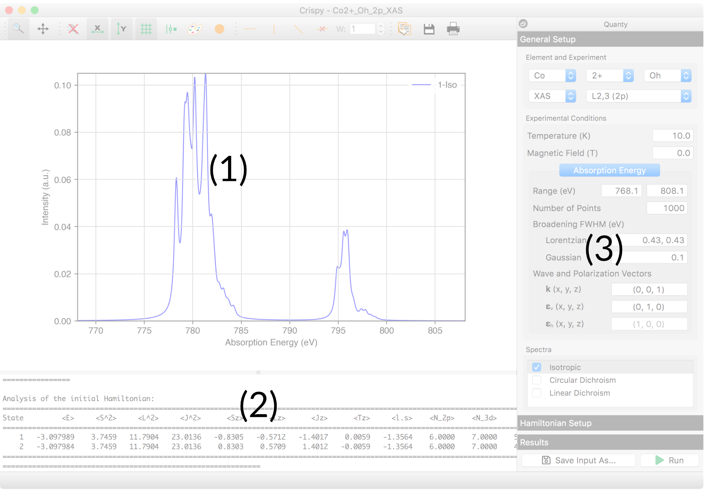
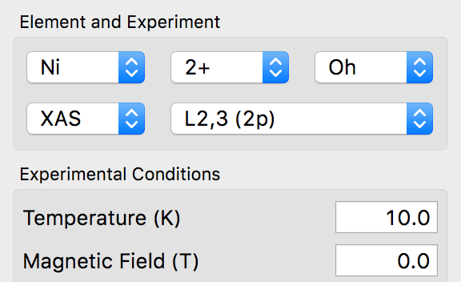
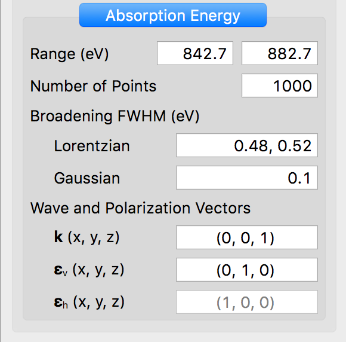
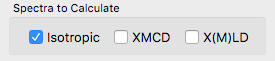
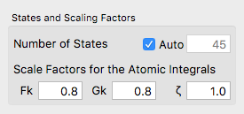
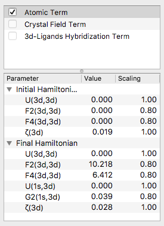
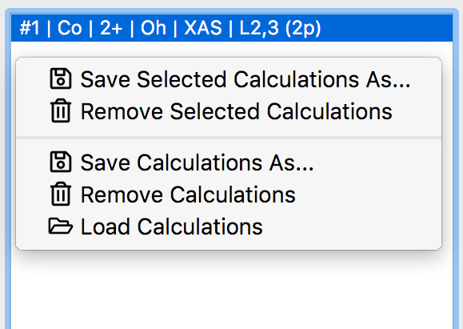
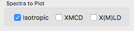
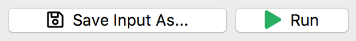

Tutorials
=========

On this page you will find links to a series of tutorials to help get you started with Crispy. They are in no particular order, so you can start with the one that interests you. Nevertheless, to make things easier to follow, have a quick look at the tour of the interface below. 

.. toctree::
    :maxdepth: 1

    ti_l23_xas.rst
    fe_spin_transition
    ni_ligand_field

Crispy's main window is divided in three parts: the plotting panel (1), the logging panel (2), and the Quanty module panel (3), as shown in the figure below.

The buttons located on the top of the plotting panel can be used to change the properties of the plot, e.g zoom, scale, aspect ration, color etc. The displayed plots can also be saved using various file formats.

While not visible initially, the logging panel will always be shown once the Quanty calculation has started. The progress of the calculation and eventual errors will be displayed here.

The Quanty module panel has a vertical tab structure. The *General Setup* tab is located at the top, and will always be displayed when Crispy is started. Here you can select the element, charge, and symmetry of the absorbing site. The type of experiment, edge, temperature, and magnetic field can also be selected here.

Depending on the type of experiment selected above, the panel below will display a single tab with the parameters of the *Absorption Energy* for a XAS calculation, or two tabs, *Incident Energy* and *Energy Transfer*, for a RIXS calculation. 

The parameters include the energy range and the number of points for the calculated spectrum. Both *Lorentzian* and *Gaussian* functions can be used to broaden the spectrum. In the case of the *Gaussian* broadening, changing the full width at half maximum (FWHM) value after the calculation has finished will trigger a re-broadening of the display spectrum; this is not the case for the *Lorentzian* broadening. This later type of broadening also supports more complex input values. For example an energy dependent broadening can be specify by using two FWHM values, one for lower energy part of the spectrum, and a second one for the high energy part. This feature is only available for |L2,3| and |M4,5| edges. Additionally the energy for the transition point between the two FWHM values can also be specified as a third parameter. This is by default the middle of the absorption energy range. Finally, in the case of |L2,3| and |M4,5| edges the wave and polarization vectors can be specified. 

At the bottom of the *General Setup* tab you can select the spectra to be calculated. Note that changing the magnetic field value above, will automatically trigger the calculation of the XMCD spectrum.

In the *Hamiltonian Setup* tab you can change the parameters of the semi-empirical model used in the calculation. It is possible to specify the number of initial Hamitonian states to consider in the calculation. The maximum number is equal to the number of states for the initial electronic configuration, e.g. 1 state for a |d0| configuration, 10 states for a |d1| configuration etc. By default the number of states considered is automatically determined based on the value of Boltzmann factors at the selected temperature, i.e. only states which will have a significant occupation at this temperature will be considered.

The scaling factors for the Coulomb, exchange, and spin-orbit coupling integrals can be changed using a set of three input boxes. Note that the scaling factors are used to alter the Hartree---Fock values of the integrals.

The bottom half of the tab contains two panels displaying the list of Hamiltonian terms and parameters. The terms can be enabled using the tick box placed in front of the name. Selecting a term will display the parameters associated with it in the panel below. Double-click on the *Value* or the *Scaling* column of a parameter to change it.

Completed calculations are displayed in the *Results* tab. The plotting panel will be automatically updated when the selected calculation changes. Right-clicking will display a context menu with a list of possible actions, e.g. saving, loading, removing etc.

The type of spectra to be plotted can be selected in the bottom panel of the *Results* tab.

At the bottom of the Quanty module panel and not part of the tab structure present  above there are two buttons. They can be used to save the input file in a different location and/or with a different name, and start the calculation. Once the calculation starts the *Run* button will change into a *Stop* button, which can be used at any time to interrupt Quanty's run.

.. |L2,3| replace:: L\ :sub:`2,3`\
.. |M4,5| replace:: M\ :sub:`4,5`\
.. |d0| replace:: d\ :sup:`0`\
.. |d1| replace:: d\ :sup:`1`\
